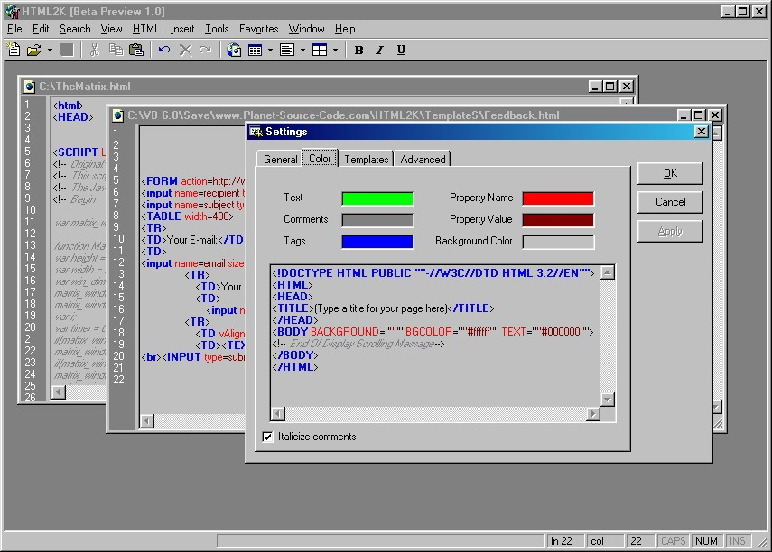



## HTML2K

### Description

HTML2K is a web page editor that I've been working on (off and on in my spare time) over the past 13 months that can perform color-syntax highlighting, spell-checking, preview your web page (using your default browser), line counting, and many other functions too numerous to mention. Take a look at the screenshot!! This is my first submission to PSC so any feedback will be greatly appreciated, along with your votes :) Thanks!
 
### More Info
 

             |
---                |---
**Submitted On**   |2000-12-21 18:40:52
**By**             |[Lil Hoss](https://github.com/Planet-Source-Code/PSCIndex/blob/master/ByAuthor/lil-hoss.md)
**Level**          |Intermediate
**User Rating**    |4.3 (13 globes from 3 users)
**Compatibility**  |VB 6\.0
**Category**       |[Complete Applications](https://github.com/Planet-Source-Code/PSCIndex/blob/master/ByCategory/complete-applications__1-27.md)
**World**          |[Visual Basic](https://github.com/Planet-Source-Code/PSCIndex/blob/master/ByWorld/visual-basic.md)
**Archive File**   |[CODE\_UPLOAD1305912262000\.zip](https://github.com/Planet-Source-Code/lil-hoss-html2k__1-13877/archive/master.zip)

